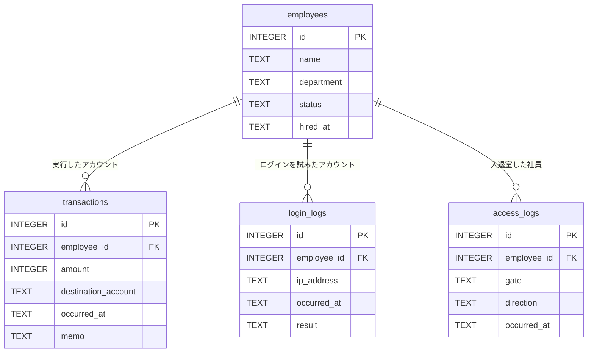

# CASE 001「消えた100万円」仕様

- 難易度: 1（MVPの導入CASE）
- 目標プレイ時間: 30〜60分
- 扱うSQL: `SELECT` / `WHERE` / `ORDER BY` / `JOIN` / 時刻の範囲条件 / `GROUP BY` / サブクエリ
- **CTE・Window Function は必須にしない**（使えば楽になるオプショナルな近道）

> ⚠️ このファイルは**ネタバレを含む**。実装者・レビュアー向け。

---

## 1. あらすじ

2026年3月14日 午前2時14分、社内経理システムから外部口座へ 1,000,000円 が送金された。
記録上の実行者は経理部の **山田 咲**（employee_id = 7）。

しかし入退室記録によれば、山田は前日19時42分に退館したきり、
その夜オフィスに戻っていない。**彼女は現場にいなかった。**

犯行時刻に在館していた唯一の人物は、情報システム部の **田中 誠**。
彼が使っていた端末（10.0.4.112）からは、犯行直前に山田のアカウントへの
ログイン失敗が3回連続で記録され、4回目で成功していた。

**真犯人: 田中 誠。手口: 他人の認証情報を使った送金。**

---

## 2. テーブル設計

### ER図



**構造は意図的に単純にする。** `employees` を中心とした3本の 1対多 のみ。

- 導入CASEなので、**ER図の読み方を覚えること自体が学習**になる。
  中間テーブルや複合キーはCASE 002以降に回す
- 3本のFKがすべて `employees.id` を指すため、
  「どのログも `employees` と JOIN すれば人物名が出る」という
  **一つのパターンを繰り返し使う**構成になる。導入として狙いどおり

**プレイヤーがER図から得るべき気づき**:

- `transactions` には人物名がない。名前を知るには `employees` と繋ぐ必要がある（→ obj-02）
- `login_logs` と `access_logs` も同じ `employees.id` で繋がる。
  つまり **「同じ人物の、別の側面の記録」** を突き合わせられる（→ obj-04, obj-05）
- `login_logs.ip_address` はどのテーブルとも繋がっていない。
  **リレーションのない列は、値そのもので突き合わせるしかない**（→ obj-06 の伏線）

最後の点が重要で、ER図に線がないからこそ obj-06（同じIPを使ったのは誰か）が
「JOINでは辿れない、値で照合する」という一段違う思考を要求する。

### アプリ内での描画

上記のmermaidは**ドキュメント用**。アプリ内のER図は `schema.json` の
`erLayout` / `relations` から**インラインSVGで描画**する
（[case-format.md §4.1](../case-format.md#41-er図のレイアウト)）。
レイアウト案:

```
   ┌──────────────┐
   │ transactions │
   └──────┬───────┘
          │
   ┌──────┴───────┐        ┌─────────────┐
   │  employees   │────────│ login_logs  │
   └──────┬───────┘        └─────────────┘
          │
   ┌──────┴───────┐
   │ access_logs  │
   └──────────────┘
```

`employees` を中央に置き、3テーブルを放射状に配置する。線が交差しない。

### employees（社員名簿）

| 列 | 型 | 説明 |
|---|---|---|
| `id` | INTEGER | 社員ID（主キー, `key: "pk"`） |
| `name` | TEXT | 氏名 |
| `department` | TEXT | 所属部署 |
| `status` | TEXT | `'active'` / `'retired'` |
| `hired_at` | TEXT | 入社日 `'YYYY-MM-DD'` |

**規模**: 12名（うち retired 2名 = ノイズ）

### transactions（取引記録）

| 列 | 型 | 説明 |
|---|---|---|
| `id` | INTEGER | 取引ID（主キー） |
| `employee_id` | INTEGER | 実行アカウントの社員ID → `employees.id`（`key: "fk"`） |
| `amount` | INTEGER | 金額（円） |
| `destination_account` | TEXT | 送金先口座 |
| `occurred_at` | TEXT | 実行日時 `'YYYY-MM-DD HH:MM:SS'` |
| `memo` | TEXT | 摘要（NULL可） |

**規模**: 約200件。2026年1〜3月。日中の通常取引が大半。
高額取引は他にも数件混ぜる（1件だけだと `ORDER BY amount DESC LIMIT 1` で一発になり、
`WHERE` を書く動機が消える）。

**鍵となる行**: `id=4821, employee_id=7, amount=1000000, occurred_at='2026-03-14 02:14:33'`

### login_logs（ログイン記録）

| 列 | 型 | 説明 |
|---|---|---|
| `id` | INTEGER | 主キー |
| `employee_id` | INTEGER | ログインを試みたアカウント → `employees.id`（`key: "fk"`） |
| `ip_address` | TEXT | 接続元IP（社内端末の固定IP） |
| `occurred_at` | TEXT | 日時 `'YYYY-MM-DD HH:MM:SS'` |
| `result` | TEXT | `'success'` / `'failure'` |

**規模**: 約400件。

**鍵となる行**:

| id | employee_id | ip_address | occurred_at | result |
|---|---|---|---|---|
| … | 12（田中 誠） | 10.0.4.112 | 2026-03-14 01:50:07 | success |
| … | 7（山田 咲） | 10.0.4.112 | 2026-03-14 02:05:11 | failure |
| … | 7（山田 咲） | 10.0.4.112 | 2026-03-14 02:06:02 | failure |
| … | 7（山田 咲） | 10.0.4.112 | 2026-03-14 02:07:44 | failure |
| … | 7（山田 咲） | 10.0.4.112 | 2026-03-14 02:09:20 | success |

### access_logs（入退室記録）

| 列 | 型 | 説明 |
|---|---|---|
| `id` | INTEGER | 主キー |
| `employee_id` | INTEGER | → `employees.id`（`key: "fk"`） |
| `gate` | TEXT | ゲート名（`'main'` / `'back'`） |
| `direction` | TEXT | `'in'` / `'out'` |
| `occurred_at` | TEXT | 日時 `'YYYY-MM-DD HH:MM:SS'` |

**規模**: 約300件。

**鍵となる行**:

- 山田 咲(7): `2026-03-13 19:42:xx` に `out`。以降 `in` の記録が**ない**
- 田中 誠(12): `2026-03-14 01:47:xx` に `in`、`02:38:xx` に `out`
- 他の社員は全員 3/13 夜までに `out` 済み

---

## 3. Objective 一覧

DAGは基本的に直列。obj-06 と obj-07 のみ並行（どちらから解いてもよい）。

```
obj-01 → obj-02 → obj-03 → obj-04 → obj-05 ─┬→ obj-06 ─┐
                                             └→ obj-07 ─┴→ 最終回答
```

| # | タイトル | 新しく登場するSQL | 判定 | 得られる証拠 |
|---|---|---|---|---|
| **obj-01** | 不審な高額送金を特定する | `SELECT` / `WHERE` / `ORDER BY` | `containsRows` on `transactions.id=4821, amount=1000000` | ev-01: 深夜2時14分の100万円送金 |
| **obj-02** | 送金アカウントの持ち主を突き止める | `JOIN` | `containsRows` on `name='山田 咲'`（+ `id=4821`） | ev-02: 記録上の実行者は山田 咲 |
| **obj-03** | 送金前後のログイン記録を洗う | 時刻の範囲条件 | `containsRows` on `ip_address='10.0.4.112', result='success'`（02:09の行） | ev-03: 端末 10.0.4.112 からのログイン |
| **obj-04** | 山田 咲が在館していたか確認する | `JOIN` + `ORDER BY` + 時刻 | `containsRows` on 3/13 19:42 の `out` 行 | ev-04: **山田はその夜オフィスにいなかった** |
| **obj-05** | 犯行時刻に在館していた人物を割り出す | サブクエリ / `GROUP BY` | `columnValues` on `name` = `['田中 誠']`, `exact: true` | ev-05: 在館者は田中 誠ただ一人 |
| **obj-06** | 端末 10.0.4.112 の利用者を調べる | `WHERE` + `JOIN` | `containsRows` on `name='田中 誠', ip_address='10.0.4.112'`（01:50の行） | ev-06: 同じ端末を田中が使っていた |
| **obj-07** | 山田アカウントへの不正アクセスの痕跡を探す | `WHERE result='failure'` / `GROUP BY` + `HAVING` | `containsRows` on 02:05 / 02:06 / 02:07 の failure 3行 | ev-07: **3回失敗し4回目で成功** |

### 判定設計のメモ

- **すべて `containsRows`**（obj-05 のみ `columnValues`）。
  「余計な列を消す」作業を強いないため（[ADR-0004](../adr/0004-answer-checking.md)）
- obj-05 だけ `exact: true` にするのは、**「田中ただ一人」という絞り込みの精度そのものが
  ストーリー上の要求**だから。ここで他人も混ざる結果を正解にすると、
  次の推理が成立しない
- obj-03 は「02:09 の success 行を含む」で判定する。時刻範囲の書き方
  （`BETWEEN` / `>=` と `<` / `LIKE '2026-03-14 02%'`）は問わない
- obj-07 は「3行すべてを含む」で判定する。`GROUP BY` + `HAVING COUNT(*) >= 3` で
  集計しても、生ログを3行出しても、どちらも到達できるようにするため、
  **failure 3行の生データを含む結果**を条件にする

> ⚠️ 実装時の注意: obj-07 を `GROUP BY` 前提の集計結果で判定すると、
> 生ログを出したプレイヤーが弾かれる。逆もまた然り。
> **判定は生ログ側に寄せ、集計は近道として許容する**という非対称にする。
> 集計でしか解けない設計が必要になったら、`checks` 配列にORの概念が必要になる
> （MVPのcheck配列はANDのみ）。その場合は case-format の拡張としてADRを書くこと。

---

## 4. 難易度上のノイズ（意図的に混ぜるもの）

推理ゲームとして成立させるため、以下を「紛らわしいが無関係なデータ」として入れる。

- **他の高額取引**: 3件ほど（すべて日中・正規の摘要つき）。`WHERE` で時刻も見る動機になる
- **退職者2名**: `status='retired'`。ログイン記録も入退室記録もない。
  素朴に `employees` を眺めると容疑者に見える
- **深夜の別ログイン**: 3/12 深夜にサーバー保守で情シスの別メンバーがログインしている記録。
  「深夜ログイン＝犯人」という短絡を1度外させる
- **山田の通常業務**: 山田名義の正規取引が日中に多数ある。
  「山田のアカウント＝すべて不正」ではないことを示す

**入れないもの**: 解決に無関係な追加テーブル。テーブル数が増えるほど
Database画面の探索コストが上がり、30〜60分に収まらなくなる。**4テーブルを上限とする。**
ER図の可読性の面でも、放射状に線が交差せず描ける上限がこのあたりになる。

---

## 5. 最終回答

```jsonc
{
  "fields": [
    {
      "id": "culprit",
      "label": "100万円を送金したのは誰ですか？",
      "type": "select",
      "options": [ /* 在籍中の社員10名すべて */ ],
      "correct": "田中 誠"
    },
    {
      "id": "method",
      "label": "どのようにして送金しましたか？",
      "type": "select",
      "options": [
        "自分のアカウントで送金した",
        "他人のアカウントの認証情報を使って送金した",
        "退職者のアカウントを再利用した",
        "システムの脆弱性を突いてデータベースを直接書き換えた"
      ],
      "correct": "他人のアカウントの認証情報を使って送金した"
    }
  ],
  "requireAll": true
}
```

容疑者を10名にするのは、**総当たりを非現実的にする**ため
（`requireAll` と組み合わせると 10 × 4 = 40通り）。

---

## 6. エピローグの要件

クリア画面で、獲得した証拠を引用しながら以下を明示的に繋いで見せる。

1. 送金記録は確かに山田のアカウント（ev-01, ev-02）
2. だが山田は現場にいなかった（ev-04）
3. その時刻の在館者は田中ただ一人（ev-05）
4. 田中の使っていた端末から山田のアカウントへログイン（ev-03, ev-06）
5. 3回失敗し、4回目で成功している = 認証情報を試していた（ev-07）

**「記録に名前が残っている＝その人がやった、とは限らない」**
というのがこの事件のテーマである、と最後に言い切る。

---

## 7. 未確定・実装時に決めること

- [ ] 各社員の氏名・部署（実在の人物と衝突しない名前にすること）
- [ ] 送金先口座の表記
- [ ] transactions / login_logs / access_logs のノイズ行の具体値（生成スクリプトで作るか手書きか）
- [ ] obj-04 の判定を「山田の最終access_log」にするか「3/14 00:00以降に山田のinがない」にするか
      → 後者は「無いことの証明」で `containsRows` と相性が悪い。**前者を採用する方針**
